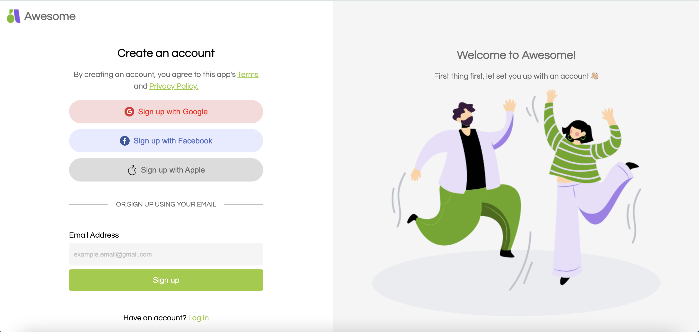

# Stylish Login Page

## Description
This project is a stylish static login page designed with HTML and CSS. It showcases a clean and modern design that can be used as a template for web applications.

## Features
- **HTML5 and CSS3**: Modern web technologies used for structure and styling.
- **Stylish UI**: Aesthetic and user-friendly design.
- **Social Media Buttons**: Includes buttons for signing up with Google, Facebook, and Apple.
- **Email Signup**: Simple and intuitive email sign-up form.

## How to Use
1. Clone or download the repository.
2. Open `AwesomeLoginPage.html` in a web browser to view the login page.

## Screenshots

 

3. ## Author
- ** S Siva Prasad **
